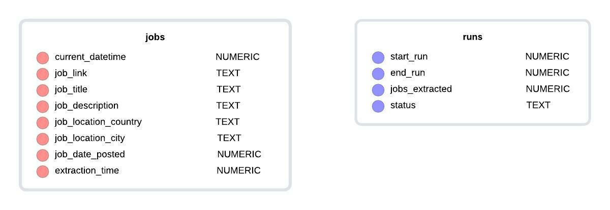

# Job Scraper

Scraper which scrapes job data from sites.

Currently, it consists of a scraper which scrapes the career pages of accenture's site.

The repo consists of :

* main.py : runs the scraper for the site every `polling_period` seconds and stores data about runs in a database
* scrape.py : consists of `Selenium_Scraper` class which provides a base class for selenium scrapers, has methods for initializing selenium webdriver and logging, which is stored in `selenium_scraper.log`.
* scraper_accenture.py : consists of `Scraper` class which inherits `Selenium_Scraper`, it contains methods for parsing the site html, it extracts the job data for the last 3 days or last 1000 jobs, whichever is smaller.

### Entity Relationship (ER) Diagram

The ER diagram is relatively simple because of not much complexity in the data being extracted. The data is stored in a lightweight sqlite3 database called `jobs.db`.

`jobs` table stores the job data :

* `current_datetime` : Current unix timestamp the moment a job information is extracted
* `job_link` : Link to the job page
* `job_title` : Title of the position
* `job_description` : Job description
* `job_location_country` : Country of job location
* `job_location_city` : City of job location
* `job_date_posted` : Unix timestamp of when the job was posted on the site, note that this can be `null`
* `extraction_time` : Time taken to extract the page containing the job data

`runs` table stores the run status of the scraper during every poll to the site :

* `start_run` : Timestamp of when the current poll to the site starts
* `end_run` : Timestamp of when the current poll to the site ends
* `jobs extracted` : Total number of new jobs extracted during a poll
* `status` : Whether the poll succeeded or failed in extracting jobs
